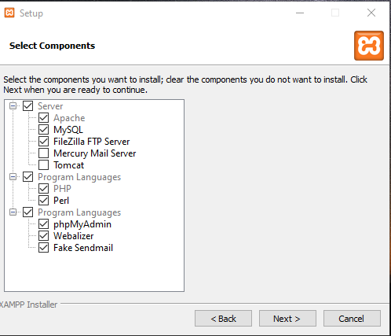
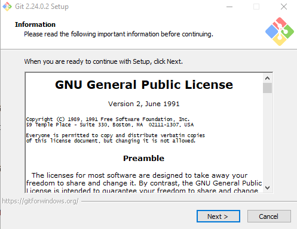
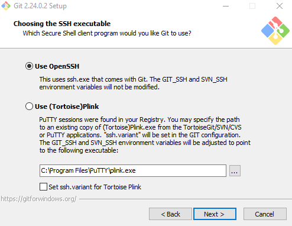

# Pelatihan laravel dan git

## Laravel


Laravel adalah kerangka kerja aplikasi web berbasis PHP yang sumber terbuka, menggunakan konsep Model-View-Controller. Laravel berada dibawah lisensi MIT, dengan menggunakan GitHub sebagai tempat berbagi kode.

## Instalasi Laravel di Windows

### Instalasi XAMPP

Silahkan Anda download program aplikasi XAMPP yang akan digunakan untuk menjalankan Laravel. Aplikasinya dapat didownload melalui link [berikut](https://www.apachefriends.org/download.html "Download XAMPP").


Xampp merupakan perangkat lunak yang difungsikan menjadi server untuk menjalankan Apache HTTP Server, MySQL database dan penerjemah bahasa pemrograman PHP dan Perl.

Setelah Anda mendownload Xampp, silahkan klik programnya untuk memulai penginstalan.


Silahkan klik Next untuk proses instalasinya. Kemudian dilanjutkan dengan pemilihan package seperti gambar dibawah



Pada pemilihan, dapat disesuaikan dengan keperluan webservernya dan klik next kembali untuk melanjutkan proses hingga selesai.

Apabila instalasi telah selesai, silahkan Anda jalankan service Apache dan MySQL.


### Instalasi Composer 

Pada langkah ini, silahkan menjalankan Composer yang akan dijadikan sebagai application package manager dan depedensi PHP beserta library. Apabila belum memiliki Composer, Anda hanya perlu mendownloadnya pada url [berikut](https://getcomposer.org/download/ "Download Composer") .


Pada gambar diatas, klik “Composer-Setup.exe” untuk mendownloadnya. Kemudian Anda bisa menginstalnya dengan 2 step mudah yaitu hanya klik Next-next hingga selesai penginstalan.

### Instalasi laravel

1. Langkah pertama, Anda perlu mengakses directory htdocs dan eksekusi perintah composer dibawah:

	```
	composer create-project laravel/laravel pelatihan-laravel
	```
	
	
	
	
	
	
2. Jika berhasil dijalankan, proses instalasinya seperti pada gambar dibawah:

		
	
3. Proses diatas diperlukan koneksi internet yang stabil karena akan mengambil resource data Laravel, maka pastikan sedang tidak ada proses lainnya yang berlangsung.

4. Setelah proses download data Laravel selesai, silahkan Anda cek di folder htdocs untuk memastikan penginstalan berjalan baik.

	
	

5. Apabila Laravel telah ada, silahkan Anda masuk ke foldernya dan menjalankan perintah php artisan serve seperti gambar diatas.

	```
	php artisan serve
	```
	
	

6. Langkah terakhir, Anda bisa mengakses http://127.0.0.1:8000 di browsernya dan akan terlihat seperti gambar berikut:

	

## Instalasi GIT

### Instalasi
1. Download git

	Untuk menginstall Git, Anda perlu mengunduh file-nya terlebih dahulu di [situs resmi GIT](https://git-scm.com/downloads "Download Git"). Download sesuai tipe sistem operasi pada komputer Anda. Apabila tipe sistem operasi komputer Anda 64bit,  pilih Git yang mendukung Windows 64bit. Tujuannya adalah agar tidak terjadi error saat proses instalasi Git.

	

2. Jalankan Aplikasi git

	Setelah selesai mengunduh file Git, buka setup aplikasi Git untuk memulai proses instalasi. Halaman awal setelah Anda membuka setup aplikasi Git adalah tampilan Document License dari Git. Klik Next untuk melanjutkan instalasi.
	
	

3. Pilih Folder Instalasi
	
	Selanjutnya, pilih lokasi untuk install Git pada komputer Anda. Pada tutorial ini kami menginstall di lokasi C:\Program Files\Git. Setelah menentukan lokasi instalasi Git, klik Next untuk melanjutkan .
	
	

4. Pilih Komponen Tambahan

	Kemudian pilih komponen tambahan untuk install Git. Fungsi komponen ini adalah untuk memperlancar penggunaan Git dan mendukung file dengan kapasitas besar. Sesuaikan komponen tambahan yang dipilih seperti pada gambar di bawah ini. Jika sudah klik Next untuk melanjutkan instalasi.
	
	
	
5. Tentukan Nama Aplikasi Git

	Sebenarnya Anda bebas mengganti nama aplikasi Git yang akan ditampilkan pada Start Menu. Akan tetapi, demi kemudahan saat mencari aplikasi ini, sebaiknya gunakan nama Git saja.  
	
	
	
6. Tentukan File Editor

	Untuk mengedit script melalui Git, Anda memerlukan file editor. Anda bebas menggunakan file editor apa pun untuk dikombinasikan dengan Git. Pada tutorial ini, kami menggunakan Vim Editor. Klik Next apabila Anda sudah menentukan file editor yang akan Anda gunakan.
	
	
	
7. Atur Path Environment

	Selanjutnya adalah pengaturan Path Environment. Path Environment berfungsi untuk mengeksekusi perintah perintah pada Git. Pilih Git from the command line and also from 3rd-party software agar saat menjalankan perintah Git dapat dikenali di Command Prompt (CMD) pada Windows.
	
	
	
8. Pilih Aplikasi SSH

	Kemudian untuk mengeksekusi SSH, Anda bisa menggunakan aplikasi dari Git atau  dari platform lain seperti PuTTY dan Bitvise. Pada tutorial ini kami menggunakan Use OpenSSH, aplikasi default SSH dari Git. Klik Next untuk melanjutkan instalasi.
	
	
	
9. Pilih Line Ending

	Selanjutnya, Anda perlu memilih pengaturan line ending. Pada tutorial ini kami memilih Checkout Windows-style, commit Unix-style line endings. Klik Next untuk melanjutkan instalasi.
	
	
	
10. Pilih Emulator Terminal

	Setelah itu, Anda perlu memilih emulator terminal yang akan digunakan. Anda bisa menggunakan Command Prompt atau MinTTY. Karena ingin menggunakan Command Prompt, pada tutorial ini kami memilih Use Windows’ default console windows. Klik Next untuk melanjutkan instalasi.
	
	
	
11. Tentukan Opsi ekstra

	Terdapat beberapa opsi ekstra yang bisa Anda pilih. Pertama, pilih Enable File System Caching agar Git memiliki fungsi system caching. Kedua, pilih Enable Git Credential Manager agar Git bisa dikombinasikan dengan aplikasi lain seperti Visual Studio, Android Studio, dan GitHub. Klik Next untuk melanjutkan instalasi.
	
	
	
12. Mulai Proses Instalasi

	Setelah menambahkan konfigurasi ekstra pada Git, Anda bisa memulai proses instalasi Git. Klik Install untuk melanjutkan proses.
	
	
	
	Berikut ini adalah tampilan proses instalasi Git. Tunggu hingga proses selesai dan Anda bisa menggunakan Git pada Windows.
	
	
	

### Setup Akun GIT
1. Daftar kan akun di github

	
	
2. Login git di cmd

	Anda bisa melakukan login awal pada Git  menggunakan Command Prompt / Git Bash  (Windows). Kemudian masukkan perintah-perintah yang akan kami jelaskan di bawah ini.

	Selanjutnya, masukkan username GitHub Anda menggunakan perintah di bawah ini. Lalu tekan ENTER jika sudah benar.

	```
	git config --global user.name "UsernameAnda"
	```

	Kemudian masukkan email yang terdaftar di GitHub Anda menggunakan perintah di bawah  ini. Lalu tekan ENTER jika sudah benar.
	
	```
	git config --global user.email IsiDenganEmailAnda@gmail.com
	```
	
	Selanjutnya untuk memastikan proses login Anda berhasil, masukkan perintah berikut.

	```
	git config --list
	```

	

### Upload proyek laravelmu ke git
1. Buat repositori baru

	
	
	
	
2. masuk ke folder project laravel dan jalankan

	```
	git init
	```
	
	
	
	baris perintah ini berfungsi untuk menginisiasi projek git. selanjutnya ketikan baris perintah :
	
	```
	git add . ; git commit -m "commit pertama";
	```
	
	
	
	baris perintah ini berfungsi menambahkan semua file dan folder yang berada di folder anda untuk di commit dengan pesan "commit pertama". Selanjutnya daftarkan repository kalian ke project git
	
	```
	git branch -M main
	git remote add origin https://github.com/aldonesia/pelatihanlaravel.git
	```

	

	baris perintah pertama untuk kita membuat branch baru bernama "main", dan mendaftarkan url repo kita ke project git. selanjutnya push untuk mengupload semua file dan folder kalian ke repository github kalian
	
	```
	git push -u origin main
	```

	

3. cek perubahan di url repository github masing masing

	

## Referensi

1. https://www.rumahweb.com/journal/cara-install-laravel-di-localhost-xampp-windows/
2. https://www.rumahweb.com/journal/install-xampp-di-windows/
3. https://www.niagahoster.co.id/blog/git-tutorial-dasar/#Cara_Install_Git_di_Windows